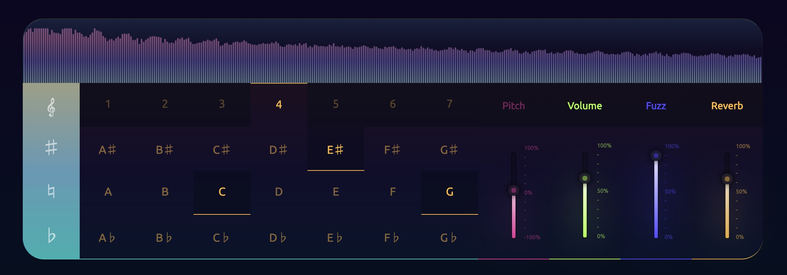

# About:

- Go to the [Heroku project](https://kebo.herokuapp.com/)
- Adjust your volume all the way down then back up to find the right level
- Click on the keyboard notes to activate keyboard interaction and click on the octave bar to use the number pad to adjust the keyboard octave. 
- Control effects by using the sliders on the right side of the synthesizer.
